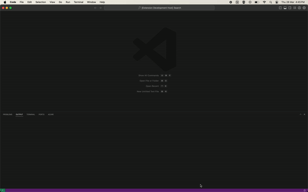

# Prayer Time Extension

This Visual Studio Code extension provides prayer time information for locations in Indonesia. It helps users to stay informed about the prayer timings according to their selected location.

## Features

- Displays next prayer time in the status bar.
- Allows users to select their location for accurate prayer timings.
- Provides options to refresh and view detailed prayer time schedules.

## Requirements

This extension requires an active internet connection to fetch accurate prayer time data. No additional dependencies are needed.

## Known Issues

- No known issues at the moment. Please report any issues [here](https://github.com/arsyaadi/prayer-time-extension/issues).

## Thanks to

- [My Quran](https://api.myquran.com/)
- [Flaticon](https://www.flaticon.com/)
